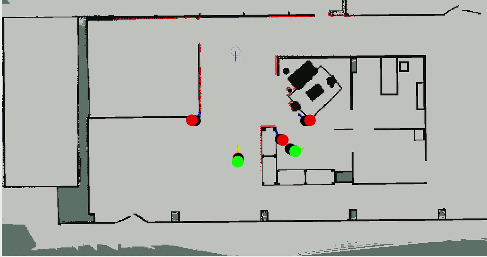

Usage Tutorial
==============

Configuring Costmaps
--------------------

Configuring of costmaps is pretty similar to the navigation stack. CoHAN offers two extra layers (Human Static and Visible) that adds more safety and legibility to the robot's plan. Here is how you add them to the costmap (either local or global):

.. code-block:: yaml

    global_costmap:
        global_costmap:
            ros__parameters:
                plugins: ["human_static_layer", "human_visibility_layer"]
                human_static_layer:
                    plugin: "cohan_layers::StaticAgentLayer"
                    agent_radius: 0.30
                    amplitude: 150.0
                human_visibility_layer:
                    plugin: "cohan_layers::AgentVisibilityLayer"
                    agent_radius: 0.30
                    amplitude: 250.0

Please edit the robot_radius and agent_radius appropriately. Example config file can be found in `nav2_params.yaml <https://github.com/sphanit/CoHAN-Nav2/blob/main/src/cohan_nav2_tutorial/config/nav2_params.yaml>`_.

Configuring HATEBLocalPlanner
-------------------------------------------

For HATEB_Local_Planner, there are several parameters. Here we show some important ones:

.. code-block:: yaml

        ## Planning Mode
        planning_mode: 1 #(0: robot navigation wuth no human planning. 1: human-aware planning)

        ## Robot Params (there are several others as well to set robot model completely -> check example files)
        robot:
            max_vel_x: 0.7
            max_vel_x_backwards: 0.4
            max_vel_theta: 1.2
            min_vel_theta: 0.1
            acc_lim_x: 0.3
            acc_lim_theta: 0.4

        # Agents (humans) and HATEB
        ## Agent Model Params
        agent:
            agent_radius: 0.30
            max_agent_vel_x: 1.3
            max_agent_vel_y: 0.4
            max_agent_vel_x_backwards: 0.01
            max_agent_vel_theta: 1.1
            agent_acc_lim_x: 0.6
            agent_acc_lim_y: 0.3
            agent_acc_lim_theta: 0.8
            
        ## HATEB Params (activate all constraints and set thresholds (these are defaults for a good performance))
        hateb:
            use_agent_agent_safety_c: True
            use_agent_robot_safety_c: True
            use_agent_robot_rel_vel_c: True
            use_agent_robot_visi_c: True
            add_invisible_humans: True
            min_agent_agent_dist: 0.4
            min_agent_robot_dist: 0.8
            rel_vel_cost_threshold: 1.5
            visibility_cost_threshold: 2.5
            invisible_human_threshold: 1.0
            prediction_time_horizon: 10.0

        # Optimization weights (Since it is based on teb, there are lot more parameters -> check example files and teb_local_planner)
        optim:
            weight_agent_robot_safety: 5.0
            weight_agent_agent_safety: 2.0
            weight_agent_robot_rel_vel: 5.0
            weight_agent_robot_visibility: 5.0
            weight_invisible_human: 1.0
            weight_kinematics_nh: 1000. ## 0 for Omni, 1000 for diff
            weight_kinematics_forward_drive: 50. 

Look at `nav2_params.yaml <https://github.com/sphanit/CoHAN-Nav2/blob/main/src/cohan_nav2_tutorial/config/nav2_params.yaml>`_ for full example configuration.

Required Topics
---------------
We assume that the robot has good *tf* and well localized in the environment (map). The following topics are required for the system to work properly::

    /tracked_agents
    /odom
    /base_scan (laser scan topic for obstacle layer)
    /joint_states (optional for simulation)

The */tracked_agents* topic uses a custom message `TrackedAgents <msg/TrackedAgents.html>`_. Other topics are standard ROS topics. An example script publishing *tracked_agents* topic can be found in `agents_bridge.py <https://github.com/sphanit/CoHAN-Nav2/blob/main/src/cohan_nav2_tutorial/scripts/agents_bridge.py>`_.

Launch file for Visible and Invisible Agents in CoHAN-Nav2
----------------------------------------------------------
Along with the node publishing tracked agents, you need to launch prediction and filter nodes before you launch move_base node. Add the following to a launch file named agents.launch.

.. code-block:: python

    from launch import LaunchDescription
    from launch.actions import DeclareLaunchArgument, GroupAction
    from launch.conditions import IfCondition, UnlessCondition
    from launch.substitutions import LaunchConfiguration, PathJoinSubstitution
    from launch_ros.substitutions import FindPackageShare
    from launch_ros.actions import Node
    from launch.event_handlers import OnProcessExit
    from launch.events import Shutdown

    def generate_launch_description():
        namespace = LaunchConfiguration('ns')
        use_namespace = LaunchConfiguration('use_namespace')
        num_agents = LaunchConfiguration('num_agents')
        use_sim_time = LaunchConfiguration('use_sim_time')

        namespace_arg = DeclareLaunchArgument(
            'ns',
            default_value='',
            description='Top-level namespace')
        
        use_namespace_arg = DeclareLaunchArgument(
            'use_namespace',
            default_value='false',
            description='Whether to apply a namespace to the agents_bridge and agent_path_predict nodes')
        
        num_agents_arg = DeclareLaunchArgument(
            'num_agents',
            default_value='1',
            description='Number of agents the robot is navigating with (excluding the robot)')
        
        sim_time_arg = DeclareLaunchArgument(
            'use_sim_time',
            default_value='true',
            description='Use simulation (Gazebo) clock if true')

        agent_tracking_nodes = GroupAction(
            condition = UnlessCondition(use_namespace),
            actions=[   
                Node(
                    package='cohan_nav2_tutorial',
                    executable='agents_bridge.py',
                    name='agents',
                    output='screen',
                    arguments=[num_agents],
                    parameters=[{'use_sim_time': use_sim_time}]
                    ),
                Node(
                    package='agent_path_prediction',
                    executable='agent_path_predict',
                    name='agent_path_predict',
                    output='screen',
                    parameters=[{
                        'goals_file': PathJoinSubstitution([
                            FindPackageShare('agent_path_prediction'),
                            'cfg',
                            'goals_adream.yaml']),
                        'use_sim_time': use_sim_time}]
                    ),
                Node(
                    package='invisible_humans_detection',
                    executable='invisible_humans_detection_node',
                    name='invisible_humans_detection',
                    output='screen',
                    parameters=[{'use_sim_time': use_sim_time}] 
                ),
                Node(
                    package='cohan_layers',
                    executable='agent_filter.py',
                    name='agent_filter',
                    output='screen',
                    arguments=[namespace],
                    parameters=[{'use_sim_time': use_sim_time}] 
                ),
            ]
        )

        namespaced_agent_tracking_nodes = GroupAction(
            condition = IfCondition(use_namespace),
            actions=[   
                Node(
                    package='cohan_nav2_tutorial',
                    executable='agents_bridge.py',
                    name='agents',
                    namespace=namespace,
                    output='screen',
                    arguments=[num_agents],
                    parameters=[{'use_sim_time': use_sim_time}]
                ),
                Node(
                    package='agent_path_prediction',
                    executable='agent_path_predict',
                    name='agent_path_predict',
                    namespace=namespace,
                    output='screen',
                    parameters=[{
                        'robot_frame_id': PathJoinSubstitution([
                            namespace,
                            'base_footprint'
                        ]),
                        'goals_file': PathJoinSubstitution([
                            FindPackageShare('agent_path_prediction'),
                            'cfg',
                            'goals_adream.yaml'
                        ]),
                        'use_sim_time': use_sim_time
                    }],
                    remappings=[('map', '/map')]
                ),

                Node(
                    package='invisible_humans_detection',
                    executable='invisible_humans_detection_node',
                    name='invisible_humans_detection',
                    output='screen',
                    namespace=namespace,
                    parameters=[{'use_sim_time': use_sim_time}],
                    remappings=[('map', '/map')]
                ),
                Node(
                    package='cohan_layers',
                    executable='agent_filter.py',
                    name='agent_filter',
                    output='screen',
                    namespace=namespace,
                    arguments=[namespace],
                    parameters=[{'use_sim_time': use_sim_time}],
                    remappings=[('map', '/map')]

                ),
            ]
        )

        ld = LaunchDescription()
        
        ## Add launch arguments
        ld.add_action(namespace_arg)
        ld.add_action(use_namespace_arg)
        ld.add_action(num_agents_arg)
        ld.add_action(sim_time_arg)

        ## Add agent tracking nodes
        ld.add_action(agent_tracking_nodes)
        ld.add_action(namespaced_agent_tracking_nodes)

        return ld

Launch files for CoHAN-Nav2 and Example 
---------------------------------------

Examples launch files for CoHAN-Nav2 are found here: `launch_files <https://github.com/sphanit/CoHAN-Nav2/tree/main/src/cohan_nav2_tutorial/launch>`_.

The main files to are `navigation_lauch.py <https://github.com/sphanit/CoHAN-Nav2/blob/main/src/cohan_nav2_tutorial/launch/navigation_launch.py>`_ that launches main controller nodes and `cohan_nav2_launch.py <https://github.com/sphanit/CoHAN-Nav2/blob/main/src/cohan_nav2_tutorial/launch/cohan_nav2_launch.py>`_ that launches everything (along with a simulator).

As ROS2 launch files in Python a large, I decided to not add all the content here for brevity.

Run CoHAN-Nav2 on the simulated robot
-------------------------------------
Launch simulator and CoHAN-Nav2 Controller. If you are using a Docker, run these inside the container. 

.. code-block:: bash

    ros2 launch cohan_nav2_tutorial cohan_nav2_launch.py

Launch teleop_keyboard to control human.

.. code-block:: bash

    ros2 run teleop_twist_keyboard teleop_twist_keyboard cmd_vel:=/human1/cmd_vel

Give a goal to the robot and move the human using the teleop_keyboard. If everything went well you should be able to see this!

